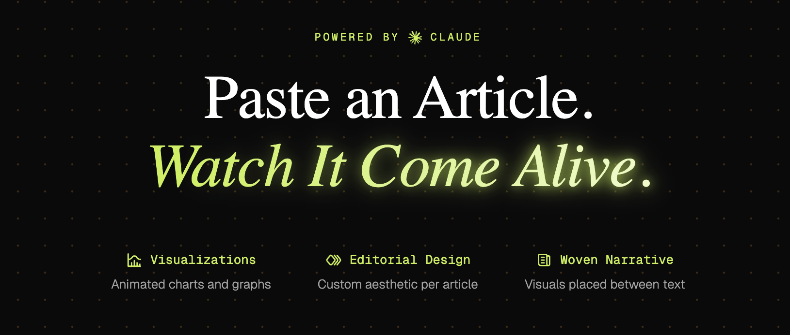
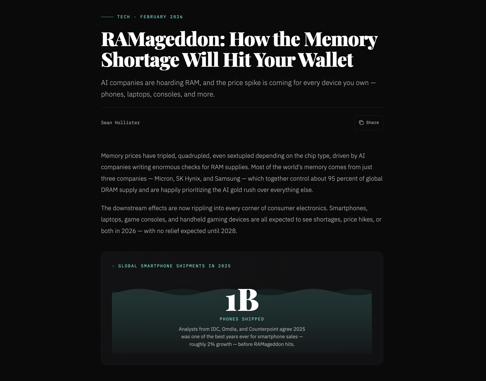
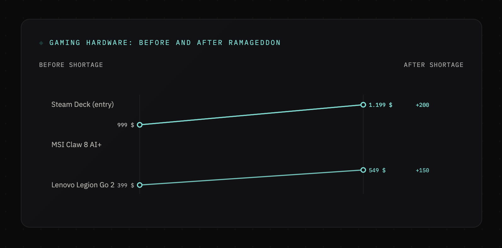
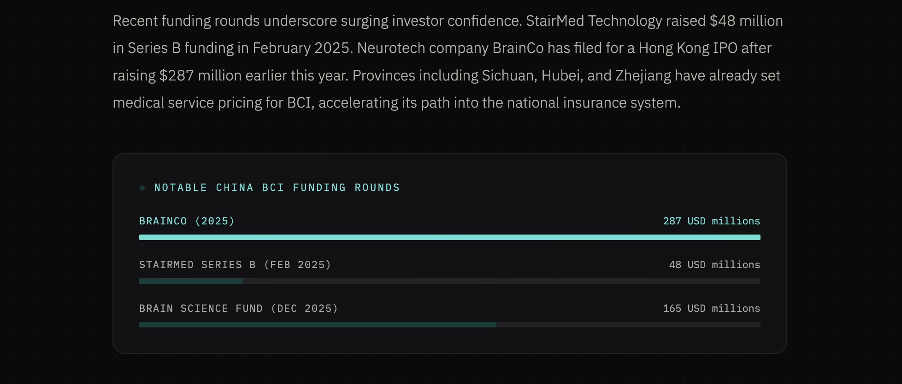
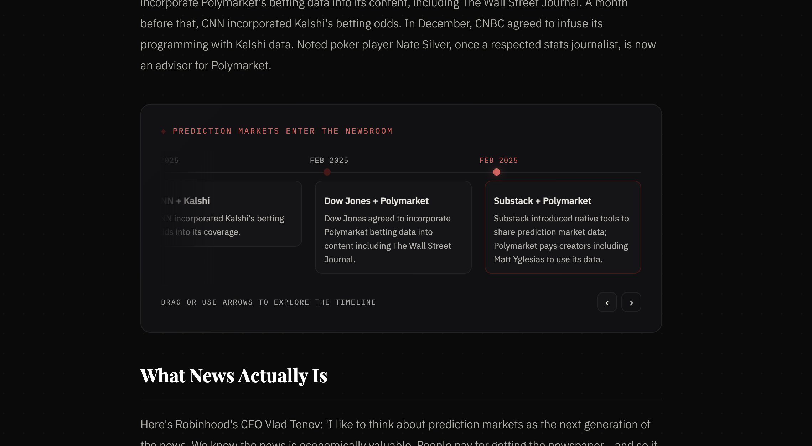
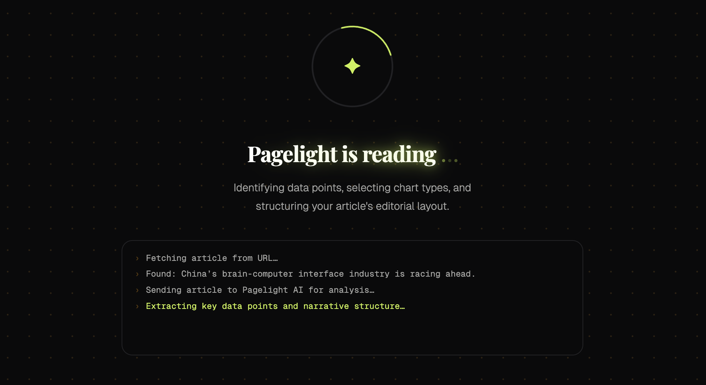

<!-- <a href="https://dub.co">
  
</a> -->

<p align="center">
  <a href="https://pagelight.mxis.ch">
    <picture>
        <source media="(prefers-color-scheme: dark)" srcset="./screenshots/bannerDark.png">
        <source media="(prefers-color-scheme: light)" srcset="./screenshots/bannerLight.png">
        
    </picture>
  </a>
</p>

<h3 align="center">Pagelight AI</h3>

<p align="center">
    Turn Articles Into Living Stories
    <br />
    <a href="https://pagelight.mxis.ch"><strong>Website »</strong></a>
    <br />
    <br />
    <a href="#features"><strong>Features</strong></a> ·
    <a href="#how-it-works"><strong>How it works</strong></a> ·
    <a href="#why-pagelight"><strong>Why Pagelight?</strong></a> ·
    <a href="#local-development"><strong>Local Development</strong></a>
</p>

<br/>

## Introduction

Pagelight AI reads your article, extracts the key data, and renders it as a beautifully designed piece with animated charts woven throughout the text.

## Features

- **Visualizations**: Animated charts and graphs
- **Editorial Design**: Custom aesthetic per article
- **Woven Narrative**: Visuals placed between text

## Examples









## How It Works



At its core, Pagelight uses the [Claude Sonnet 4.6](https://www.anthropic.com/claude/sonnet) LLM to analyze the structure and content of an article, blog post or report. It identifies key data points, trends, and narrative elements, then picks pre-built visualizations that complement the text.

Finally it combines the analyzed data and selected visualizations into a custom page that weaves visuals between paragraphs, creating a more engaging reading experience

Before using Pagelight you need to provide a [Anthropic API key](https://platform.claude.com/settings/keys). Your API key will be stored locally in your browser and is never sent to our servers or anyone else except Anthropic.

## Why Pagelight?

This started as a fun experiment: using AI to spice up long-form reading by pulling out the “interesting bits” and giving them a visual home. Articles are full of numbers, comparisons, and timelines — Pagelight tries to make those moments feel tangible.

Initially built for personal use, I soon realized it could be useful for others too. It’s a way to make dense information more engaging and accessible, especially for people who are visual learners or just want a fresh way to experience content.

## Local Development

Pagelight AI is built with Next.js and Bun. To run it locally, make sure you have Bun installed, then clone the repo:

```bash
git clone https://github.com/betahuhn/pagelight.git
```

Install dependencies with Bun:

```bash
bun install
```

Start the Next development server:

```bash
bun run dev
```

Edit `app/page.tsx` to customize the homepage content. The app will automatically reload as you make changes.
